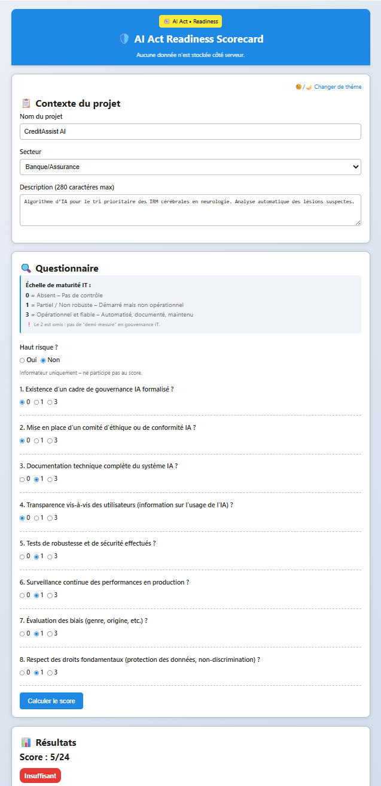

<!--
README • Projet démonstrateur - Eddy AZEBAZE
Objectif : clarté + crédibilité + conversion
-->

<!-- BANNIÈRE -->
<p align="center">
  
</p>

<!-- BADGES -->
<p align="center">
  <a href="https://drive.google.com/file/d/1HpOpIDhgdS3ZMlbaKKTIynjAB1n4rhrZ/view?usp=drive_link">
    
  </a>
  
  <a href="https://github.com/eddyazebaze/ai-act-readiness-scorecard">
    
  </a>
</p>

# 🛡️ AI Act Readiness Scorecard  
### _Outil d’auto-évaluation de conformité IA – orienté DSI / CTO / Architectes_

> **100 % hors ligne • Zéro dépendance • Aucune donnée collectée • RGPD by design**


---

## Objectif

Un outil simple et autonome pour :  
- **Évaluer** la conformité d’un système IA à l’AI Act européen  
- **Détecter** les écarts critiques (gouvernance, sécurité, transparence)  
- **Prioriser** les actions IT (P1/P2/P3) selon le risque opérationnel  
- **Générer** des artefacts prêts audit (PIA allégé, logs, documentation)  

👉 **Public cible :** DSI, CTO, PMO, DPO, auditeurs internes

---

## Valeur ajoutée

| Fonctionnalité | Différenciation |
|----------------|-----------------|
| Évaluation en 5 min | Pas besoin de juriste pour démarrer |
| Score sur 24 pts | Mesure **opérationnelle** de la maturité IT |
| Plan d’action P1/P2/P3 | Recommandations techniques **priorisées** |
| 100 % hors ligne | Aucun risque de fuite, **pas de cloud** |
| Export audit-ready | TXT / PDF, **prêt comité** |

---

## Méthodologie de scoring

- 8 questions → score max **/24**  
- Échelle :  
  - **0-10** : insuffisant (risque élevé)  
  - **11-20** : moyen (améliorations nécessaires)  
  - **21-24** : conforme solide  

⚠️ La question *“Haut risque ?”* sensibilise à la classification AI Act (ex. dispositifs médicaux, scoring crédit) → **hors-score**.

---

## Exemples de cas d’usage

| Contexte | Score | Niveau |
|----------|-------|--------|
| Crédit bancaire | 5/24 | ❌ |
| Tri médical | 20/24 | 🔶 |
| Chatbot RH | 22/24 | ✅ |



---

## Structure du dépôt

```
ai-act-readiness-scorecard/
├─ README.md                  # Documentation principale
├─ LICENSE                    # Licence MIT
├─ index.html                 # Application statique 100% offline
│
├─ assets/                    # Ressources visuelles
│   ├─ banner-projet-augmente.png
│   ├─ screenshot-responsive-clair.png
│   ├─ snapshot-chatbot-rh-clair.png
│   ├─ snapshot-scoring-credit-clair.png
│   └─ snapshot-tri-medical-clair.png
│
└─ mobile/                    # Application mobile (iOS)
    ├─ README.md              # Documentation mobile
    ├─ exports/
    │   └─ emergent-export.zip
    └─ screenshots/
        ├─ home-screen.png
        ├─ score-credit-assist-ai.png
        ├─ score-hr-assistant-pro.png
        └─ score-neuroscan-ai.png
```

---

## Évolutions prévues

- Upload de fichiers (PIA, docs techniques)  
- Mode multi-projets (benchmark)  
- Intégration MLOps (Prometheus, Grafana, MLflow)  
- Export PDF signable (logo + signature numérique)  

---

## Passer à l’action

> *« Un contrôle incomplet n’est pas un contrôle. »*  

- 👉 [Réserver 30 min](https://calendly.com/eddy-azebaze-proton/30min)  
- 👉 [LinkedIn](https://www.linkedin.com/in/eddy-azebaze-pmp-cism)  
- 👉 [Email direct](mailto:eddy.azebaze@proton.me)  
- 👉 [Medium](https://medium.com/@eddyazebaze)  

---

## Licence

Projet sous licence **MIT** - libre d’usage et d’adaptation avec attribution.

---

<sub>© Projet Augmenté® - démonstrateur fourni “as-is” pour usage d’évaluation. Conformité RGPD / NIS2 / DORA / AI Act. Traçabilité et réversibilité au cœur de la démarche.</sub>
