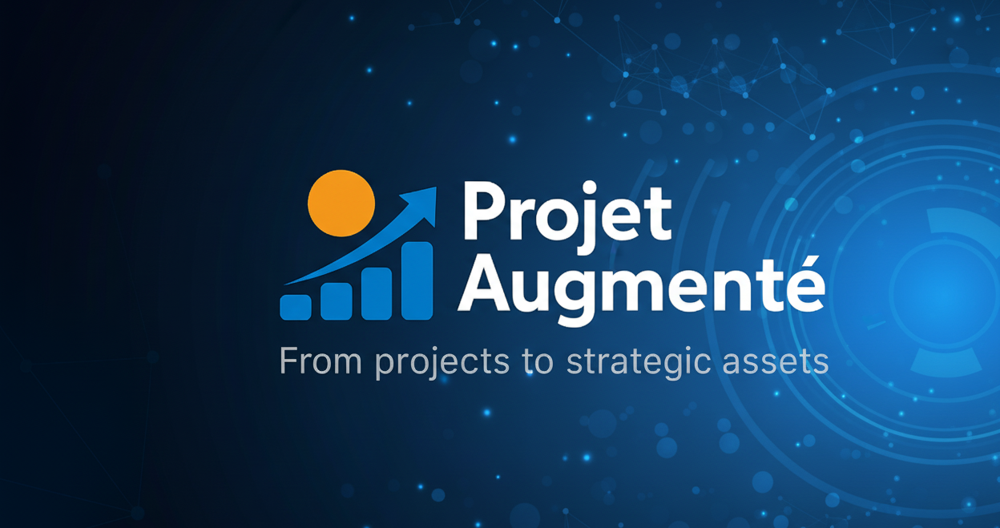

# 🛡️ AI Act Readiness Scorecard  
### _Outil d’auto-évaluation de conformité IA – Orienté DSI / CTO / Architectes_

> **100 % hors ligne • Zero dépendance • Aucune donnée collectée • Conforme RGPD par conception**

[📱 Mobile & Web] • [✅ Hors ligne] • [🇫🇷 FR] • [🔒 Zero data]

➡️ ****

> *"Un contrôle incomplet n’est pas un contrôle."*  
> Cet outil évalue la **maturité IT réelle** d’un système IA face à l’AI Act — pas seulement la compliance théorique.

---

<!-- BANNIÈRE -->

  

<h1 align="center">🛡️ AI Act Readiness Scorecard</h1>

<em>Outil d’auto-évaluation de conformité IA - Orienté DSI / CTO / Architectes</em>

  <a href="https://www.linkedin.com/in/eddy-azebaze-pmp-cism">LinkedIn</a> •
  <a href="mailto:eddy.azebaze@proton.me">Email</a> •
  <a href="https://calendly.com/eddy-azebaze-proton/30min">Réserver 30&nbsp;min</a> •
  <a href="https://medium.com/@eddyazebaze">Medium</a>

  
  
  

---

## 🎯 Objectif

Un outil simple et autonome pour :  
- Évaluer la conformité d’un système IA à l’AI Act européen  
- Détecter les écarts critiques en gouvernance, sécurité et transparence  
- Prioriser les actions IT (P1/P2/P3) selon le risque opérationnel  
- Générer des artefacts prêts pour l’audit (PIA allégé, logs, documentation)  

👉 **Public cible :** DSI, CTO, PMO, DPO, auditeurs internes

---

## 🧠 Valeur ajoutée

| Fonctionnalité | Différenciation |
|----------------|-----------------|
| Évaluation en 5 min | Pas besoin de juriste pour démarrer |
| Score sur 24 pts | Mesure la maturité IT réelle |
| Plan d’action P1/P2/P3 | Recommandations techniques priorisées |
| 100 % hors ligne | Aucun risque de fuite, pas de cloud |
| Export audit-ready | TXT, PDF, impression |

---

## 🧩 Méthodologie de scoring

- 8 questions → score max **24**  
- Échelle :  
  - **0-10** : insuffisant (risque élevé)  
  - **11-20** : moyen (améliorations nécessaires)  
  - **21-24** : conforme solide  

⚠️ La question *“Haut risque ?”* sensibilise à la classification AI Act (ex. dispositifs médicaux, scoring crédit).  

---

## 📊 Exemples de cas d’usage

| Contexte | Score | Niveau |
|----------|-------|--------|
| Crédit bancaire | 5/24 | ❌ Insuffisant |
| Tri médical | 20/24 | 🔶 Moyen |
| Chatbot RH | 22/24 | ✅ Bon |

---

## 🚀 Évolutions prévues

- Upload de fichiers (PIA, docs techniques)  
- Mode multi-projets (benchmark)  
- Intégration MLOps (Prometheus, Grafana, MLflow)  
- Export PDF signable (logo + signature numérique)  

---

## 🎯 Passer à l’action

- 👉 [Réserver 30 min](https://calendly.com/eddy-azebaze-proton/30min)  
- 👉 [LinkedIn](https://www.linkedin.com/in/eddy-azebaze-pmp-cism)  
- 👉 [Email](mailto:eddy.azebaze@proton.me)  
- 👉 [Medium](https://medium.com/@eddyazebaze)  

---

© Projet Augmenté® - démonstrateur fourni “as-is” pour usage d’évaluation. Conformité RGPD / NIS2 / DORA / AI Act. Traçabilité et réversibilité au cœur de la démarche.
