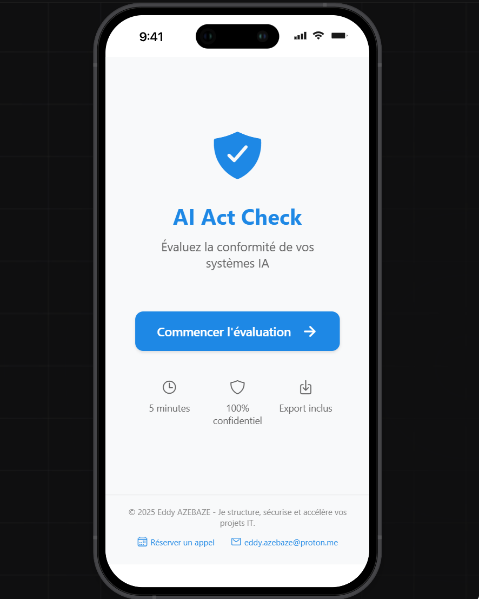
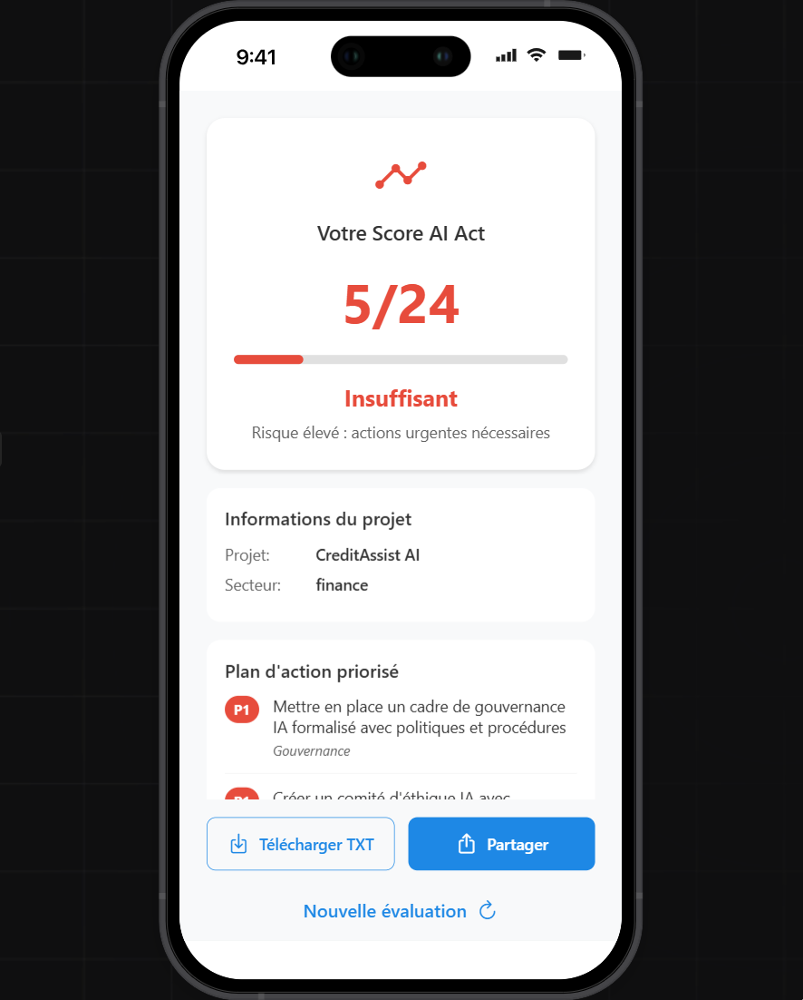
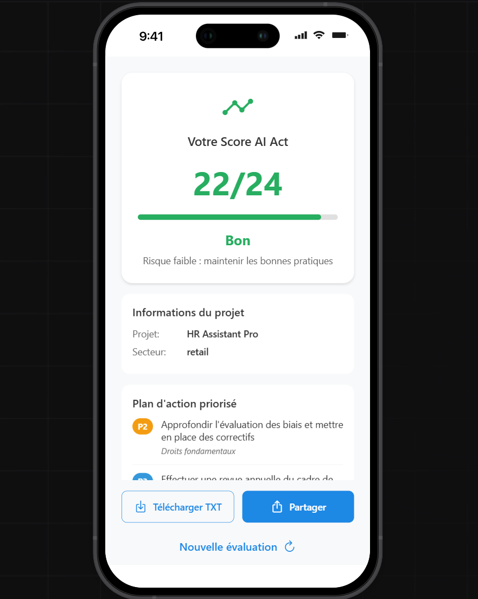

<!-- BANNIÈRE -->
<p align="center">
  
</p>

# 📱 AI Act Readiness Scorecard - Application Mobile
Version mobile développée sur [Emergent.sh](https://emergent.sh) pour **iOS**, dans le cadre du projet **AI Act Readiness Scorecard**.

> ✅ 100 % hors ligne • ✅ Aucune donnée collectée • ✅ Interface en français • ✅ Conforme RGPD

---

## Objectif

L’application mobile permet aux **décideurs IT (DSI, CTO, DPO)** de réaliser une **auto-évaluation rapide de conformité IA** directement depuis leur smartphone, en moins de 5 minutes.  

- Idéale pour les comités de pilotage, audits de terrain et déplacements  
- Fonctionne **sans cloud, sans compte, sans collecte de données**  
- Résultats exportables en **TXT ou PDF**  

---

## Fonctionnalités clés

| Fonctionnalité | Valeur ajoutée |
|----------------|----------------|
| Évaluation en mobilité | Toujours disponible, même hors connexion |
| Score en 24 points | Mesure opérationnelle de la maturité IT |
| Export instantané | Résultats prêts pour un comité ou un audit |
| Interface simplifiée | Français, thème clair, branding adapté |

---

## Captures d’écran

| Écran | Description |
|-------|-------------|
|  | **Accueil** - bouton “Commencer l’évaluation”, identité Projet Augmenté |
|  | **Scoring crédit (banque)** - Score 5/24, niveau ❌ Insuffisant |
|  | **Tri médical (santé)** - Score 20/24, niveau 🔶 Moyen |
|  | **Chatbot RH (entreprise)** - Score 22/24, niveau ✅ Bon |

> Ces exemples reflètent des cas réels et illustrent la diversité des maturités IT.

---

## Structure du dépôt

```
mobile/
├── exports/
│   └── emergent-export.zip       # Code source exporté d’Emergent.sh
├── screenshots/
│   ├── banner-projet-augmente.png
│   ├── home-screen.png
│   ├── score-credit-assist-ai.png
│   ├── score-neuroscan-ai.png
│   └── score-hr-assistant-pro.png
└── README.md
```

---

## Mode d’emploi

1. Télécharger le fichier ZIP :  
   → `mobile/exports/emergent-export.zip`  
2. L’importer dans [Emergent.sh](https://emergent.sh) pour :  
   - Dupliquer le projet  
   - Adapter les couleurs, textes, ou questions  
   - Générer une nouvelle version iOS  
3. Exporter l’application et partager le lien de démo  

---

## Passer à l’action

Ce projet est conçu par **Eddy AZEBAZE** - **Chef de projet IT & PMO stratégique**, spécialisé en **gestion de projets complexes**, **data**, **IA responsable**, **conformité réglementaire** (AI Act, RGPD, NIS2, DORA) et **gouvernance IT orientée valeur**.  

- 👉 [Réserver 30 min](https://calendly.com/eddy-azebaze-proton/30min)  
- 👉 [LinkedIn](https://www.linkedin.com/in/eddy-azebaze-pmp-cism)  
- 👉 [Email direct](mailto:eddy.azebaze@proton.me)  
- 👉 [Medium](https://medium.com/@eddyazebaze)  

---

> *«💡 « On ne livre pas un projet. On construit un actif stratégique : durable, traçable et auditable. »

---

## Licence
Projet sous licence **MIT** - libre pour usage et adaptation, avec attribution.  

---

<sub>© Projet Augmenté® - démonstrateur mobile fourni “as-is” pour usage d’évaluation. Conformité RGPD / AI Act. Traçabilité et réversibilité au cœur de la démarche.</sub>
